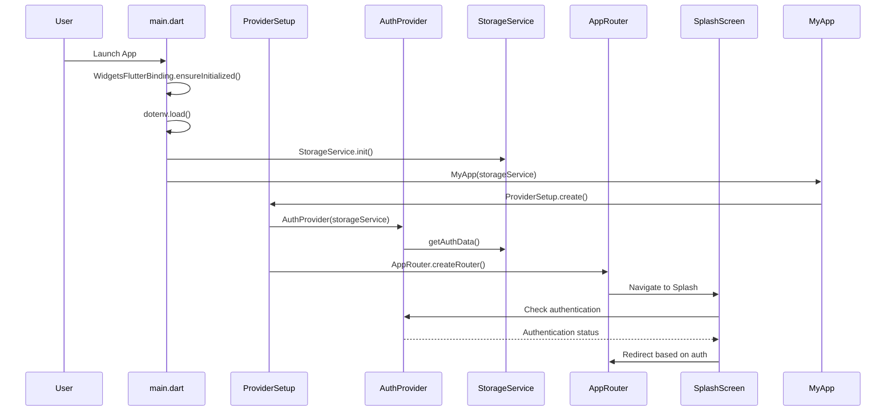
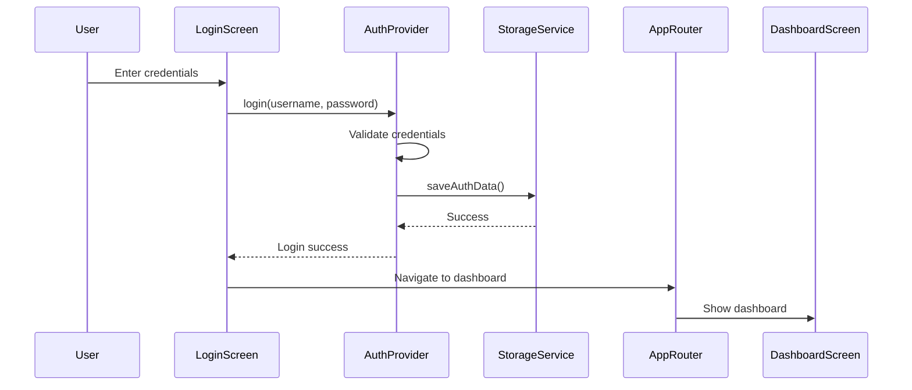
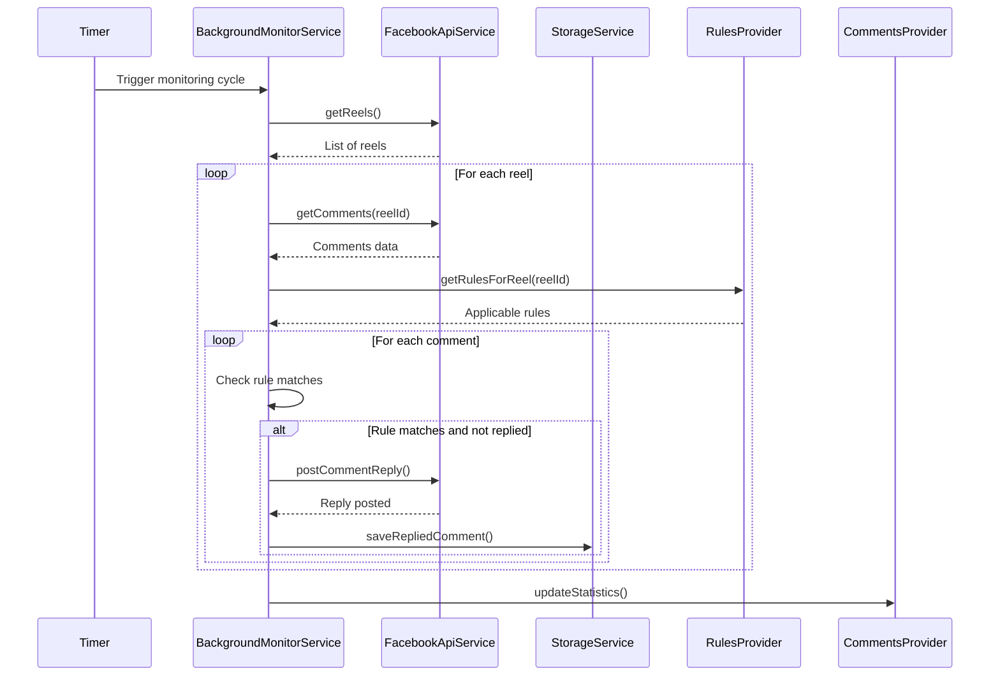
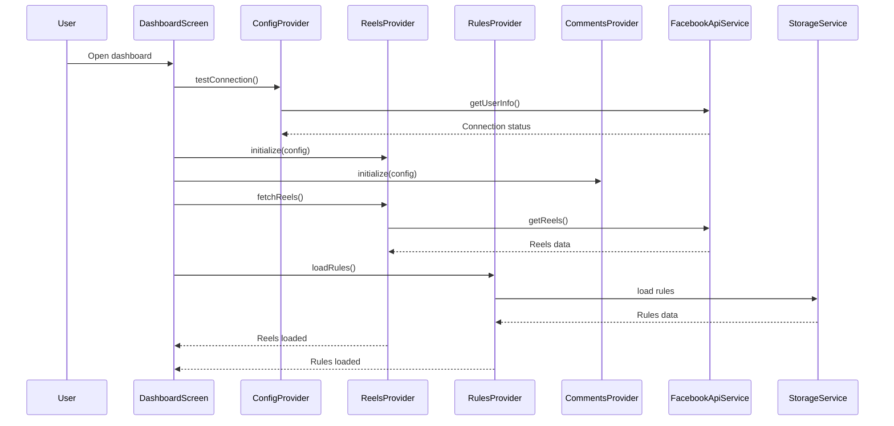

# SociWave - Architecture & Design Documentation

**Version:** 1.0.0
**Date:** November 21, 2025
**Status:** Production Ready

---

## 📋 Table of Contents

1. [System Overview](#system-overview)
2. [Architecture Principles](#architecture-principles)
3. [Layered Architecture](#layered-architecture)
4. [Component Architecture](#component-architecture)
5. [Data Flow & State Management](#data-flow--state-management)
6. [Sequence Diagrams](#sequence-diagrams)
7. [API Integration](#api-integration)
8. [Security Considerations](#security-considerations)
9. [Performance Optimizations](#performance-optimizations)

---

## 🎯 System Overview

SociWave is a cross-platform Flutter web application for automated Facebook Reel comment monitoring and reply management. The system provides real-time comment tracking, customizable auto-reply rules, and comprehensive dashboard analytics.

### Core Features

- **🎬 Reel Management**: Fetch and display Facebook video reels
- **📝 Comment Monitoring**: Real-time comment tracking with auto-refresh
- **🤖 Automated Replies**: Keyword-based rule matching and auto-replies
- **🔄 Background Monitoring**: Continuous monitoring every 5 minutes
- **📊 Dashboard Analytics**: Statistics and monitoring status
- **🔐 Secure API Integration**: Facebook Graph API with token management
- **🎨 Modern UI**: Responsive Material Design interface
- **🚀 Multiple Refresh Methods**: Manual, pull-to-refresh, auto-refresh
- **🐳 Docker Ready**: Containerized deployment
- **🌐 PWA Support**: Progressive Web App capabilities

---

## 🏗️ Architecture Principles

### Clean Architecture

SociWave follows Clean Architecture principles with clear separation of concerns:

```
┌─────────────────────────────────────┐
│           Presentation Layer        │  ← Flutter UI (Screens, Widgets)
├─────────────────────────────────────┤
│         Application Layer           │  ← State Management (Providers)
├─────────────────────────────────────┤
│          Domain Layer               │  ← Business Logic (Models, Rules)
├─────────────────────────────────────┤
│          Data Layer                 │  ← External APIs (Facebook, Storage)
└─────────────────────────────────────┘
```

### SOLID Principles

- **Single Responsibility**: Each class has one reason to change
- **Open/Closed**: Open for extension, closed for modification
- **Liskov Substitution**: Subtypes are substitutable for base types
- **Interface Segregation**: Clients depend only on methods they use
- **Dependency Inversion**: High-level modules don't depend on low-level modules

### Design Patterns

- **Provider Pattern**: For state management and dependency injection
- **Repository Pattern**: For data access abstraction
- **Factory Pattern**: For object creation (API services)
- **Observer Pattern**: For reactive UI updates
- **Strategy Pattern**: For different API implementations (real vs mock)

---

## 📁 Layered Architecture

### 1. Core Layer (`lib/core/`)

Foundation utilities and constants:

```
core/
├── constants/
│   ├── app_constants.dart      # App-wide constants
│   ├── api_constants.dart      # Facebook API constants
│   └── storage_constants.dart  # Storage keys
├── utils/
│   ├── logger.dart             # Centralized logging
│   ├── validators.dart         # Input validation
│   └── date_formatter.dart     # Date/time formatting
```

**Responsibilities:**
- Application constants and configuration
- Utility functions and helpers
- Logging and error handling
- Input validation and formatting

### 2. Domain Layer (`lib/domain/`)

Business logic and data models:

```
domain/
├── models/
│   ├── comment.dart/.g.dart    # Comment data structure
│   ├── config.dart/.g.dart     # App configuration
│   ├── monitor_status.dart/.g.dart # Monitoring state
│   ├── reel.dart/.g.dart       # Facebook reel data
│   └── rule.dart/.g.dart       # Auto-reply rules
```

**Responsibilities:**
- Define business entities and value objects
- Implement business rules and validation
- Provide domain-specific logic
- Ensure data integrity and consistency

### 3. Data Layer (`lib/data/`)

External data access and persistence:

```
data/
├── services/
│   ├── facebook_api_service.dart   # Facebook Graph API client
│   ├── mock_api_service.dart       # Mock data for testing
│   └── storage_service.dart        # Local storage (SharedPreferences)
```

**Responsibilities:**
- Abstract external data sources
- Handle API communication
- Manage local data persistence
- Provide data transformation and caching

### 4. Application Layer (`lib/providers/`)

State management and application logic:

```
providers/
├── auth_provider.dart         # Authentication state
├── comments_provider.dart     # Comment management
├── config_provider.dart       # Configuration management
├── monitor_provider.dart      # Background monitoring
├── provider_setup.dart        # Provider initialization
├── reels_provider.dart        # Reel data management
└── rules_provider.dart        # Auto-reply rules
```

**Responsibilities:**
- Manage application state
- Coordinate between layers
- Handle business use cases
- Provide reactive state updates

### 5. Presentation Layer (`lib/screens/`, `lib/widgets/`)

User interface components:

```
screens/
├── comments_screen.dart       # Comment viewing and management
├── dashboard_screen.dart      # Main dashboard
├── login_screen.dart          # Authentication
├── rule_editor_screen.dart    # Rule creation/editing
├── settings_screen.dart       # App configuration
└── splash_screen.dart         # Loading screen

widgets/
├── comment_card.dart          # Comment display
├── empty_state.dart           # Empty state UI
├── error_display.dart         # Error handling UI
├── loading_indicator.dart     # Loading animations
├── loading_overlay.dart       # Loading overlays
├── main_layout.dart           # App shell layout
├── reel_card.dart             # Reel display
└── stat_card.dart             # Statistics display
```

**Responsibilities:**
- Render UI components
- Handle user interactions
- Display data from providers
- Manage navigation and routing

### 6. Infrastructure Layer (`lib/services/`, `lib/router/`)

Supporting services and navigation:

```
services/
└── background_monitor_service.dart  # Background monitoring

router/
└── app_router.dart                  # Navigation configuration
```

**Responsibilities:**
- Background processing
- Navigation and routing
- Platform-specific integrations
- External service coordination

---

## 🧩 Component Architecture

### Provider Components

| Provider | Responsibility | Dependencies |
|----------|----------------|--------------|
| `AuthProvider` | User authentication state | StorageService |
| `ConfigProvider` | App configuration management | StorageService |
| `ReelsProvider` | Facebook reels data | ConfigProvider, FacebookApiService |
| `CommentsProvider` | Comment management | ConfigProvider, FacebookApiService |
| `RulesProvider` | Auto-reply rules | StorageService |
| `MonitorProvider` | Background monitoring | BackgroundMonitorService |

### Screen Components

| Screen | Purpose | Key Features |
|--------|---------|--------------|
| `SplashScreen` | App initialization | Loading animation, auth check |
| `LoginScreen` | User authentication | Form validation, error handling |
| `DashboardScreen` | Main overview | Reels grid, statistics, refresh |
| `CommentsScreen` | Comment management | Comment list, reply actions |
| `RuleEditorScreen` | Rule configuration | Form inputs, validation |
| `SettingsScreen` | App configuration | API settings, monitoring controls |

### Widget Components

| Widget | Purpose | Usage |
|--------|---------|-------|
| `MainLayout` | App shell | Navigation, responsive layout |
| `ReelCard` | Reel display | Dashboard grid, actions |
| `CommentCard` | Comment display | Comments screen, replies |
| `StatCard` | Statistics | Dashboard metrics |
| `LoadingIndicator` | Loading states | Async operations |
| `EmptyState` | Empty states | No data scenarios |
| `ErrorDisplay` | Error handling | API failures, validation |
| `LoadingOverlay` | Blocking operations | Long-running tasks |

---

## 🔄 Data Flow & State Management

### State Management Pattern

SociWave uses the Provider pattern with ChangeNotifier for reactive state management:

```dart
// Provider Setup (MultiProvider)
ProviderSetup.create(
  storageService: storageService,
  child: App(),
)

// Usage in Widgets
Consumer<ReelsProvider>(
  builder: (context, provider, child) {
    if (provider.isLoading) {
      return LoadingIndicator();
    }
    return ReelsGrid(reels: provider.reels);
  },
)
```

### Data Flow Diagram

```
User Interaction
       ↓
    Screen/Widget
       ↓
     Provider (Business Logic)
       ↓
   Domain Models (Validation)
       ↓
    Data Services (API/Storage)
       ↓
External Systems (Facebook API)
```

### State Synchronization

- **Reactive Updates**: Providers notify listeners on state changes
- **Async Operations**: Futures and Streams for background tasks
- **Error Handling**: Try-catch with user-friendly error messages
- **Loading States**: Loading indicators during async operations

---

## 📊 Sequence Diagrams

### 1. Application Startup Sequence



### 2. Login Flow



### 3. Comment Monitoring Cycle



### 4. Dashboard Data Loading



---

## 🔗 API Integration

### Facebook Graph API

SociWave integrates with Facebook Graph API v18.0+:

```dart
// API Service Architecture
class FacebookApiService {
  final Dio _dio;
  final Config config;

  // Endpoints
  Future<List<Reel>> getReels({int? limit})
  Future<List<Comment>> getComments(String reelId)
  Future<bool> postCommentReply(String commentId, String message)
  Future<Map<String, dynamic>> getUserInfo()
}
```

### API Configuration

```yaml
# API Constants
baseUrl: https://graph.facebook.com
version: v18.0
endpoints:
  reels: /videos
  comments: /{reelId}/comments
  replies: /{commentId}/comments
```

### Error Handling

- **Network Errors**: Retry logic with exponential backoff
- **API Rate Limits**: Respect Facebook's rate limiting
- **Token Expiration**: Automatic token refresh handling
- **Invalid Responses**: Graceful degradation with user feedback

---

## � Reply Management Architecture

### Reply Tracking Strategy

SociWave uses Facebook's native reply data instead of local storage to track which comments have been replied to. This ensures accuracy and eliminates synchronization issues.

**Key Benefits:**
- **Real-time Accuracy**: Reply status comes directly from Facebook API
- **Cross-device Sync**: Works seamlessly across different devices/sessions
- **No Storage Overhead**: Eliminates local storage maintenance
- **Duplicate Prevention**: Facebook API prevents duplicate replies automatically

**Implementation:**
```dart
// Check if page has already replied using nested replies data
bool hasPageReplied(String pageId) {
  if (replies == null || replies!.isEmpty) return false;
  return replies!.any((reply) => reply.from?.id == pageId);
}
```

### Comments Without Author Information

The system handles comments where Facebook API doesn't return author information (deleted accounts, privacy restrictions) by:

- **Displaying Placeholder**: Shows "[Unknown User]" for anonymous comments
- **Preserving Functionality**: Reply actions work using comment ID only
- **No Filtering**: All comments are displayed for complete visibility

### Configurable Replies Limit

Users can configure how many nested replies are fetched per comment (1-100, default: 100).

**API Request Format:**
```
/{comment-id}?fields=id,message,from,created_time,updated_time,comments.limit(100).summary(true){id,message,from,created_time}
```

**Performance Considerations:**
- **Lower Values (10-20)**: Faster API responses, reduced data transfer
- **Higher Values (50-100)**: More complete data, slower responses
- **Use Cases**: Adjust based on community activity and bandwidth constraints

---

## �🔒 Security Considerations

### Token Management

- **Secure Storage**: Facebook access tokens stored in FlutterSecureStorage
- **Token Validation**: Regular token validity checks
- **Token Rotation**: Support for token refresh (future enhancement)

### Data Protection

- **No Data Persistence**: Comments and reels not stored locally
- **Memory Management**: Sensitive data cleared on logout
- **HTTPS Only**: All API communications over HTTPS

### Authentication

- **Session Management**: Persistent login state
- **Logout Security**: Complete session cleanup
- **Mock Data Mode**: Development mode without real API access

---

## ⚡ Performance Optimizations

### UI Performance

- **Efficient Rebuilding**: Provider consumers with proper scoping
- **Lazy Loading**: Comments loaded on demand
- **Image Optimization**: Efficient image loading and caching
- **Responsive Design**: Adaptive layouts for different screen sizes

### Network Performance

- **Request Batching**: Multiple API calls optimized
- **Caching Strategy**: Local storage for configuration and rules
- **Background Processing**: Non-blocking monitoring cycles
- **Connection Pooling**: Dio HTTP client optimization

### Memory Management

- **Provider Lifecycle**: Proper disposal of resources
- **Stream Management**: Cleanup of reactive subscriptions
- **Image Caching**: Controlled memory usage for media assets

---

## 🚀 Deployment Architecture

### Web Deployment

```
User Browser
    ↓
Nginx (Static Files)
    ↓
Flutter Web App (WASM/JS)
    ↓
Facebook Graph API
```

### Docker Deployment

```yaml
# Multi-stage Docker build
FROM flutter:latest AS build
WORKDIR /app
COPY . .
RUN flutter build web --release

FROM nginx:alpine
COPY --from=build /app/build/web /usr/share/nginx/html
COPY nginx.conf /etc/nginx/nginx.conf
```

### PWA Features

- **Offline Support**: Service worker for caching
- **Installable**: Web App Manifest for installation
- **Push Notifications**: Background sync capabilities
- **Responsive**: Mobile-first design approach

---

## 📈 Monitoring & Analytics

### Application Metrics

- **API Response Times**: Performance monitoring
- **Error Rates**: Exception tracking and reporting
- **User Interactions**: Usage analytics
- **Background Tasks**: Monitoring service health

### Business Metrics

- **Comments Processed**: Total comments monitored
- **Auto-Replies Sent**: Successful reply operations
- **Rule Matches**: Keyword matching statistics
- **Reel Coverage**: Number of monitored reels

---

## 🔮 Future Enhancements

### Backend Integration

- **REST API**: Python FastAPI backend for 24/7 monitoring
- **Database**: PostgreSQL for data persistence
- **Webhooks**: Real-time Facebook webhook integration
- **Scalability**: Horizontal scaling with load balancing

### Advanced Features

- **AI-Powered Replies**: Machine learning for smart responses
- **Multi-Platform Support**: Instagram, Twitter integration
- **Analytics Dashboard**: Advanced reporting and insights
- **Team Collaboration**: Multi-user access and permissions

---

*This documentation reflects the current architecture as of November 21, 2025. For the latest updates, refer to the project repository.*</content>
<parameter name="filePath">/home/worker/sociwave/docs/ARCHITECTURE_DESIGN.md